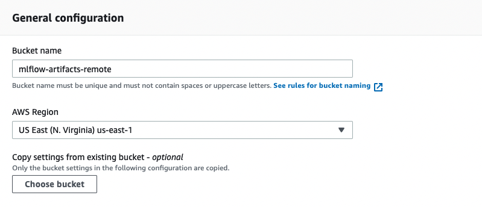
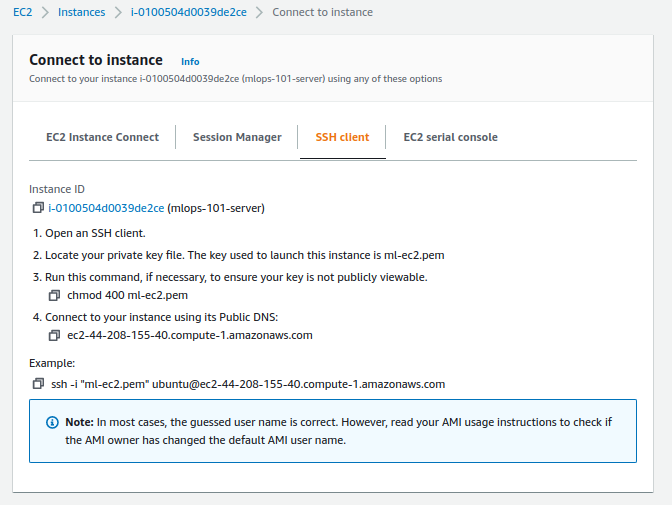
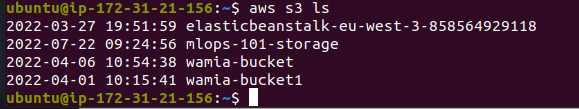
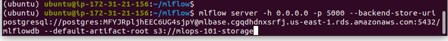
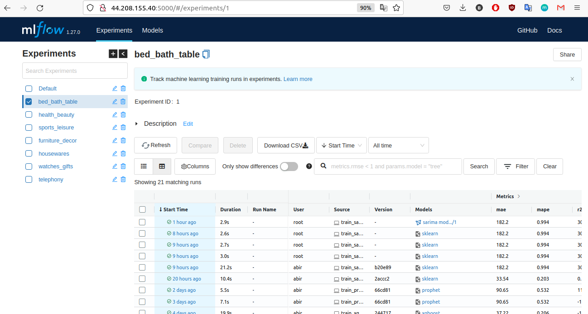

# MLflow on AWS Setup Guide

This repository contains the setup process for deploying a remote tracking server using MLflow on AWS. The guide provides step-by-step instructions for configuring AWS services, launching an EC2 instance, setting up MLflow, and integrating it with the machine learning model training.

## Table of Contents

1. [Purpose](#Purpose)
2. [Process Implementation](#Process_Implementation)
     - [Launch a new EC2 instancep](#1-launch-a-new-ec2-instance)
     - [S3 Configuration](#2-s3-configuration)
     - [PostgreSQL database](#3-postgresql-database)
     - [Set up EC2 machine with MLflow](#4-set-up-ec2-machine-with-mlflow)
     - [Set AWS credentials](#5-set-aws-credentials) 
     - [Access the remote storage](#6-access-the-remote-storage)
     - [Launch the tracking server](#7-launch-the-tracking-server)
     - [Integrate MLflow in training model code](#8-integrate-mlflow-in-training-model-code)
     - [UI Experiments Hosted on EC2](#9-ui-experiments-hosted-on-ec2)

3. [Contributing](#contributing)


## Purpose

The purpose of this repository is to guide you through the process of setting up a centralized tracking server for managing machine learning experiments using MLflow on AWS. By following this guide, users can establish a scalable and secure infrastructure for tracking experiment metadata, parameters, metrics, and artifacts, facilitating collaboration, reproducibility, and efficient model development in the Mlops pipeline.


## Process Implementation
     
### 1. **Launch a new EC2 instance**:
   - **Objective**: Launch a new EC2 instance to host the MLflow tracking server.
   - **Actions**:
     - Create an IAM user and store the access key ID and secret access key securely.
     - Launch a new EC2 instance, choose the instance type, create a new key pair, and edit the security group to accept SSH and HTTP connections.
     


### 2. **S3 Configuration**:
   - **Objective**: Create an S3 bucket to be used as the artifact store with appropriate configurations.
   


### 3. **PostgreSQL database**:
   - **Objective**: Create a new PostgreSQL database on RDS to be used as the backend store for the mlflow remote server .
   .png)

### 4. **Set up EC2 machine with MLflow**:
   - **Objective**: Set up the EC2 instance with MLflow and its dependencies.
   - **Actions**:
     - SSH into the EC2 instance and  to install the necessary dependencies.
     

     - Install pip, Python3-pip and MLflow dependencies using Pipenv.
     ```bash
      sudo apt update
      sudo apt install python3-pip

      pipenv install mlflow
      pipenv install awscli
      pipenv install boto3
      ```


### 5. **Set AWS credentials**:
   - **Objective**: To allow uploading artifacts to the S3 bucket, we need to set AWS credentials as environment variables on the EC2 instance.
   ```bash
   export AWS_ACCESS_KEY_ID=<your-aws-access-key-id>
   export AWS_SECRET_ACCESS_KEY =<your-aws-secret-access-key>
   ```
### 6. **Access the remote storage**: 
   - **Objective**: Before launching the server, we must check that the instance can access the s3 bucket.
   - **Action** : we just run this command from the EC2 instance to see the mlops 101-storage bucket. 

   
### 7. **Launch the tracking server**:
   
   - To launch the MLflow tracking server on the EC2 instance we can use this command : 


### 8. **Integrate MLflow in training model code**:
   - **Objective**: Integrate MLflow into the training model code to log parameters, metrics, and artifacts.
     - Import MLflow in the code, set tracking URI, and create an experiment.
     - Use MLflow Tracking APIs to log parameters, metrics, and artifacts.

     ```python
     import mlflow

     mlflow.set_tracking_uri("http://ec2-44-208-155-40.compute-1.amazonaws.com:5000")

     for prod_cat in params["Sales"]["product_categories"]:
        print(f"Processing product category: {prod_cat}")
        mlflow.set_experiment(prod_cat)

     with mlflow.start_run():
        mlflow.log_param("Product Category", prod_cat)
     ```
### 9. **UI Experiments Hosted on EC2**:
     - Access the MLflow UI using the EC2 instance's public IP address to view model runs, metadata, and MLflow components.
     


## Contributions

Contributions to this repository are welcome! If you identify any improvements or have additional insights feel free to open a pull request.
